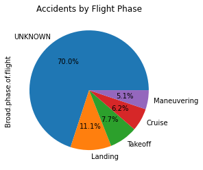

# ASSESSING POTENTIAL RISKS OF AIRCRAFT FOR FLEET ACQUISITION

## PROJECT OVERVIEW
It is our company's wish to expand to new industries to diversify its portfolio. The company is interested in purchasing and operating airplanes for commercial and private enterprises. The goal of this project is to find the aircraft with the lowest risk for both commercial and private operations. This project is focused on analyzing available aircraft data, assessing risks, and delivering clear, actionable recommendations to guide the head of the new aviation division to make purchasing decisions.

## BUSINESS UNDERSTANDING

A company's decision to diversify and acquire aircraft is a major investment that impacts operational efficiency, safety, maintenance costs, and profitability for years to come. Choosing aircraft without a clear assessment of potential risks can lead to significant financial losses and operational disruptions.

The objective of this project is to systematically assess and evaluate the potential risks associated with various aircraft models under consideration for fleet acquisition. This involves analyzing historical performance data, safety incident records, accident frequency, fatality cases and other relevant factors.

By identifying aircraft with lower risk profiles, the head of aviation division can make more informed acquisition decisions, leading to increased operational reliability, reduced maintenance expenses, enhanced passenger satisfaction, and long-term financial savings.

## DATA UNDERSTANDING AND ANALYSIS

The data for this project is a dataset found at (https://www.kaggle.com/datasets/khsamaha/aviation-accident-database-synopses) from the National Transportation Safety Board that includes aviation accident data from 1962 to 2023 about civil aviation accidents and selected incidents in the United States and international waters.

The data is of comma separated values format. This means that the data is in form of a table but separated by commas, such that the first row represents the columns titles or headers of the data and each row or line is an observation.  

The data has 90,348 rows and 31 columns. There are columns with missing data. The important values of the data that is going to be used in analysing include: Event.id, Make and model of aircraft, number of fatalities, number of minor injuries among others.

I will need to do preprocessing of this data before use because it has significant missing values. I am going to drop the columns which have great number of missing values. For those columns essential for the project but have missing values, I will drop the rows with missing data.

The data is relevant for the project because it has all that we require to analyze and come up with a decision on which aircrafts to acquire and which ones to avoid.

## Visualizations
1. Unsafe aircrafts

2. Top safest aircrafts - as per the number of accidents and fatalities

3. Accidents by flight phase. - This shows the phase at which accidents occur. Since there were so many missing data on this and I decided to fill them with *unknown* from the pie chart we can see that most accidents occur at an unknown phase. The second phase in the landing followed by the take off phase. I recommend the management to consider more training on this once they make the acquisision.

## CONCLUSION

#
